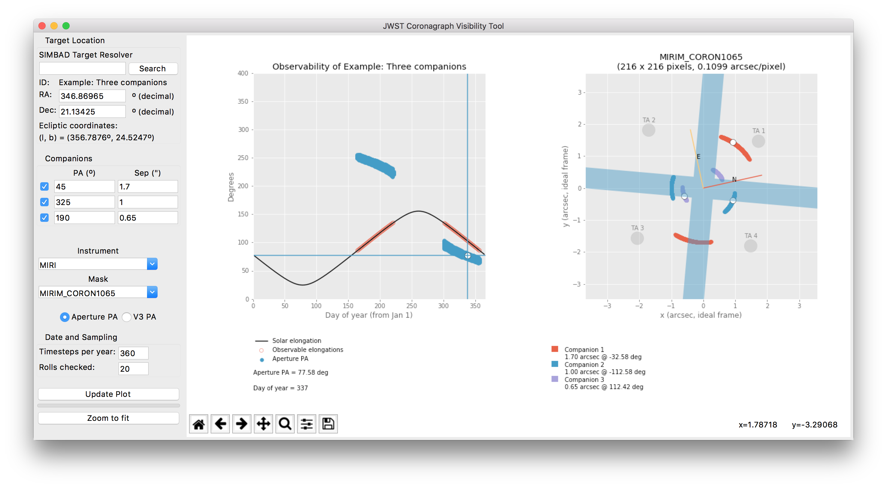

JWST Coronagraph Visibility Tool
================================

Current version: 0.4.2 (beta).
SIAF version: PRDOPSSOC-M-026

`Download for macOS (754.5 MB) <https://github.com/spacetelescope/jwst_coronagraph_visibility/releases/download/0.4.2/jwst_coronagraph_visibility_tool_macos.zip>`_ | `Download Python source <https://github.com/spacetelescope/jwst_coronagraph_visibility/archive/0.4.2.zip>`_ | ``$ pip install jwst-coronagraph-visibility``

**Report any issues at https://github.com/spacetelescope/jwst_coronagraph_visibility/issues/new or via email to the authors.**

*Authors: Christopher Stark (cstark@stsci.edu), Joseph Long, J. Brendan Hagan (hagan@stsci.edu)

The allowed pointing of JWST leads to target visibility that depends on ecliptic latitude, and the range of roll angles allowed depends on solar elongation. The allowed PAs for a target can thus be a complicated function of time. As a result, it can be difficult to 1) understand the possible orientations of a given target on the detector, 2) determine the ideal roll angle offsets for multi-roll observations, and 3) determine a group of targets that are simultaneously visible. The JWST Coronagraph Visibility Tool (CVT) was created to address these issues and assist with creating APT programs and diagnosing scheduling errors.

We stress that the CVT is designed to provide quick illustrations of the possible observable orientations for a given target. As such, the CVT rapidly approximates JWST’s pointing restrictions and **does not query the official JWST Proposal Constraint Generator (PCG)**. The CVT does not include detailed pointing restrictions like Earth and Moon avoidance, etc. Additionally, results may differ from official constraints by a degree or so. **Users should treat the results as close approximations.**

Additionally, detector geometry (e.g. conversion from sky coordinates to the instrument's ``Idl`` frame) is provided by the SIAF (Science Image Aperture File). The SIAF is a standardized format for manipulating instrument apertures and coordinate conversions, maintained by STScI as part of operating JWST.

For installation instructions and usage instructions, see the `documentation <https://github.com/spacetelescope/jwst_coronagraph_visibility/blob/master/docs/index.rst>`_ on GitHub or ``docs/index.rst`` in this repository.

Known Issues
------------

  * The CVT does not (and will not) query the JWST Proposal Constraint Generator. The only constraint on the field of regard is the Sun and anti-Sun avoidance angle.
  * Target name resolution depends on the availability of the SIMBAD service. If the service cannot be reached, you will have to enter coordinates yourself.
  * The CVT does not currently provide a way to export the plotted points as text. Plots can be saved from the GUI using the save icon below the plot panel.
  * The CVT has only been tested on Mac and Linux. Issue reports from Windows users are welcome, and we will do our best to address them, but we are not testing the tool on Windows.

*See issue tracker at* https://github.com/spacetelescope/jwst_coronagraph_visibility/issues.

Release Notes
-------------

0.4.2
^^^^^
* Update to fix bug in Mac OS app bundle.

0.4.1
^^^^^
* Minor update to setup.py file that enables proper display of documentation on PyPI. No code was changed in this release, but a new release is necessary in order to update PyPI.

0.4.0
^^^^^

* This release discontinues use of the ``jwxml`` package and now uses the STScI supported ``pysiaf`` package for all information using the SIAF. This releases uses version 0.6.3 of ``pysiaf`` which uses ``PRDOPSSOC-M-026`` as default for the JWST SIAF.
* CVT no longer supports python 2.7

0.3.0
^^^^^

This release fixes two issues with the GUI:

  * `#15 <https://github.com/spacetelescope/jwst_coronagraph_visibility/issues/15>`_ - NIRCam A long-wavelength bar mask was flipped left-to-right in the GUI but is now oriented correctly
  * `#12 <https://github.com/spacetelescope/jwst_coronagraph_visibility/issues/12>`_ - The SIMBAD search field is now cleared when user enters RA/Dec or chooses an example

0.2.0
^^^^^

This release incorporates some minor improvements based on user feedback, as well as revised definitions of the science instrument apertures in the SIAF (version ``PRDOPSSOC-F-008``).

 * Add MIRI Target Acq positions to plot (`#5 <https://github.com/spacetelescope/jwst_coronagraph_visibility/issues/5>`_)
 * Make the MIRI TA spots translucent and renamed by APT numbers (`#5 <https://github.com/spacetelescope/jwst_coronagraph_visibility/issues/5>`_)
 * Add zoom to fit button (`#6 <https://github.com/spacetelescope/jwst_coronagraph_visibility/issues/6>`_)
 * Make the calculation start on Jan 1 instead of Oct 1 (`#9 <https://github.com/spacetelescope/jwst_coronagraph_visibility/issues/9>`_)
 * Show day of year in plot overlay (`#9 <https://github.com/spacetelescope/jwst_coronagraph_visibility/issues/9>`_)
 * Update development instructions

0.1.0
^^^^^

The tool has been renamed to ``jwst_coronagraph_visibility`` with the command to launch the GUI taking on the name ``jwst-coronagraph-visibility-gui``.

``jwxml`` has been updated to ``PRDOPSSOC-E-002`` (v0.2.0), which is required for new aperture names used by this tool.

NIRCam coronagraph ND squares and clips are now drawn in the right hand (detector) plot.

A ``LICENSE`` file has been added to reflect availability under the 3-Clause BSD license.

0.0.2
^^^^^

  * The SIAF is now bundled with the jwxml package, and targets PRDDEVSOC-D-012. This includes minor refinements to the transformations from sky coordinates to the coronagraph aperture coordinates.
  * NIRCam Module B is no longer a selectable instrument.
  * Add controls for the sampling of the roll angle and time of year.

0.0.1
^^^^^

The first tagged release of the tool for internal and external testing. Target visibility plots from this tool should always be checked against APT for consistency, as this tool does not account for all of the same constraints (and is not intended to).
