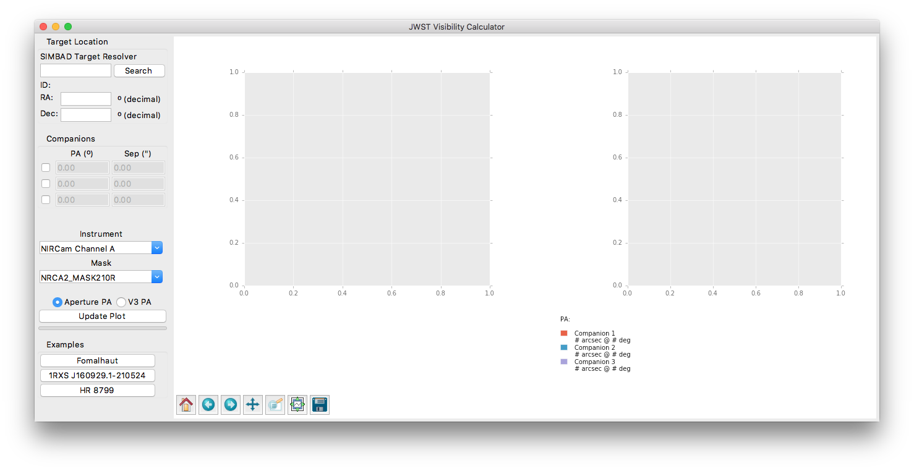
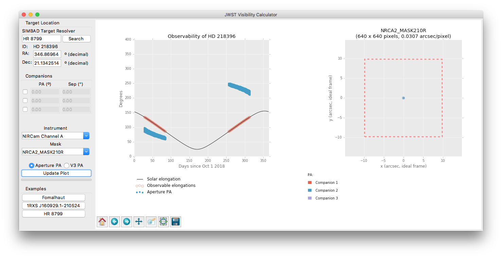
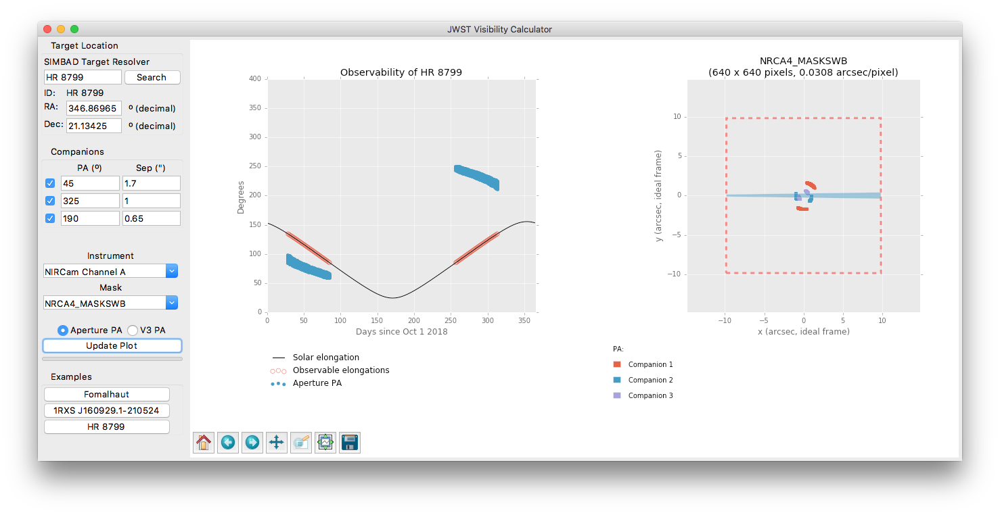
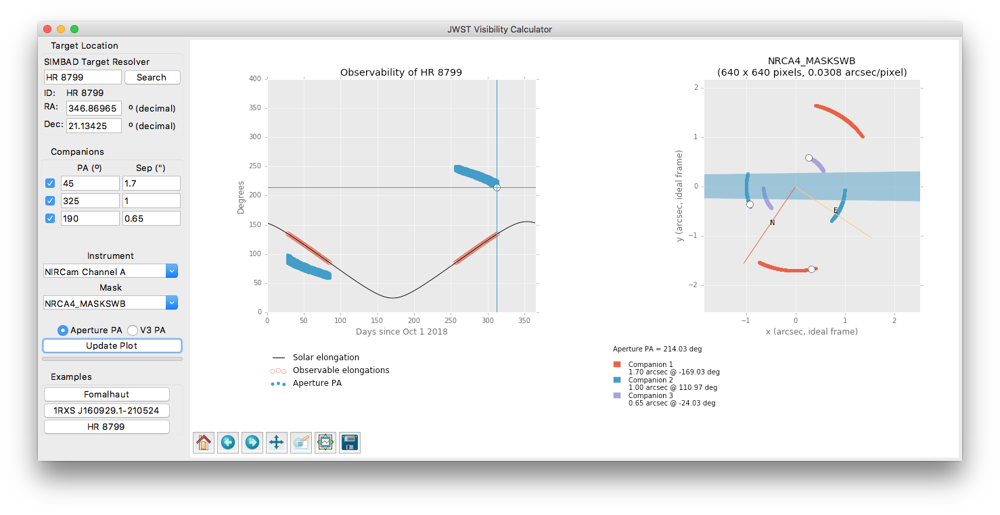
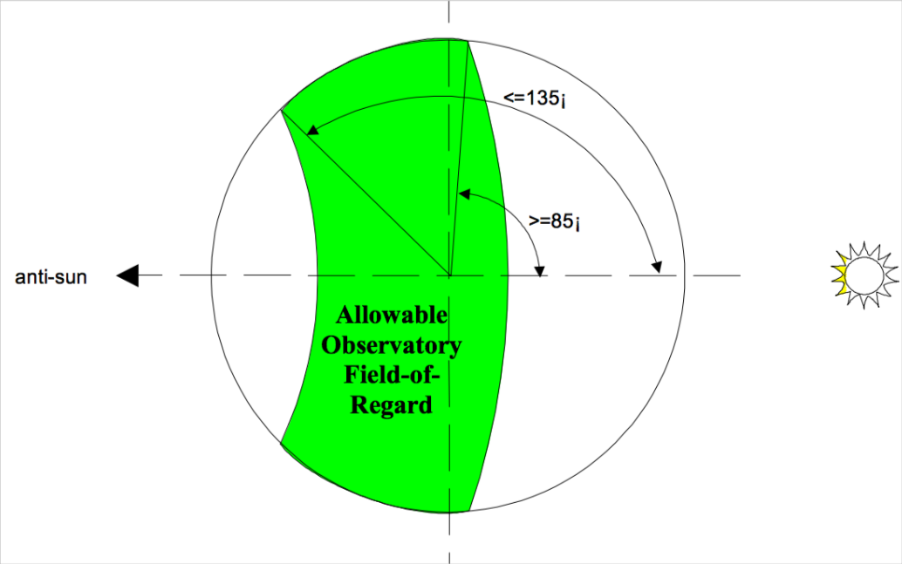
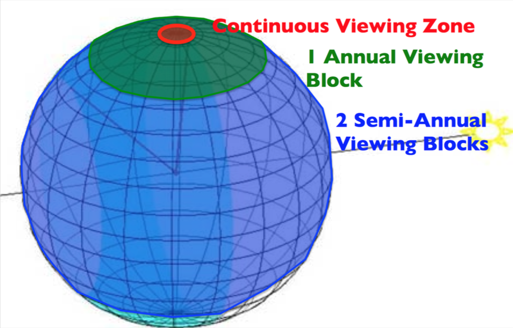
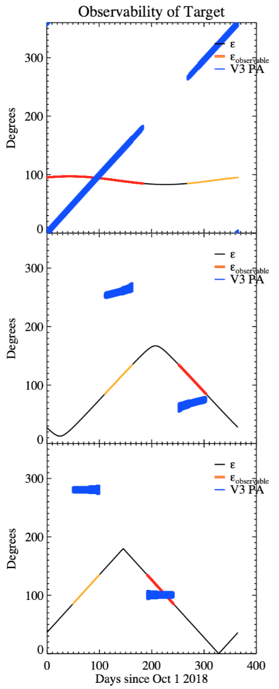

***************************
JWST Target Visibility Tool
***************************

*Authors:* Christopher Stark <cstark@stsci.edu>, Joseph Long <jlong@stsci.edu>

Introduction
============

The allowed pointing of JWST leads to target visibility that depends on ecliptic latitude, and the range of roll angles allowed depends on solar elongation. The allowed PAs for a target can thus be a complicated function of time. As a result, it can be difficult to:

  1. understand the possible orientations of a given target on the detector
  2. determine the ideal roll angle offsets for multi-roll observations, and
  3. determine a group of targets that are simultaneously visible.

The JWST Target Visibility Tool (Coronagraph Visibility Calculator) was created to address these issues and assist with creating APT programs and diagnosing scheduling errors.

We stress that the Target Visibility Tool is designed to provide quick illustrations of the possible observable orientations for a given target. As such, the Target Visibility Tool rapidly approximates JWST’s pointing restrictions and does not query the official JWST Proposal Constraint Generator (PCG). The Target Visibility Tool does not include detailed pointing restrictions like Earth and Moon avoidance, etc. Additionally, results may differ from official constraints by a degree or so. Users should treat the results as close approximations.

Downloading & installing the Target Visibility Tool
===================================================

The latest release of the Target Visibility Tool can be downloaded from https://github.com/spacetelescope/jwst_visibility/releases. Both source Python and macOS app bundles are available.

**To run the macOS app bundle,** download the appropriate zip file and decompress it, then double-click to run the JWST Target Visibility Tool.

If you prefer to install from source, or are not using macOS, we recommend installing Python with the conda package manager and using the `AstroConda <http://astroconda.readthedocs.io/en/latest/index.html>`_ package set supported by STScI. After following the `AstroConda installation instructions <http://astroconda.readthedocs.io/en/latest/installation.html>`_, the following command will install the JWST Target Visibility Tool:

   pip install -e git+https://github.com/spacetelescope/jwst_visibility.git#egg=jwst-visibility

If you would rather not use AstroConda, read on.

What are the prerequisites for installing the JWST Target Visibility Tool?
^^^^^^^^^^^^^^^^^^^^^^^^^^^^^^^^^^^^^^^^^^^^^^^^^^^^^^^^^^^^^^^^^^^^^^^^^^

The JWST Target Visibility Tool depends on:

 * Python 2.7, 3.4, or 3.5
 * NumPy version 1.9.0 (or greater)
 * Matplotlib version 1.4.2 (or greater)
 * requests version 2.8.1 (or greater)

Running the automated test suite additionally depends on pytest version 2.9.1 (or greater). Building the documentation requires Sphinx version 1.4.5 (or greater).

Can I install the JWST Target Visibility Tool without using conda at all?
^^^^^^^^^^^^^^^^^^^^^^^^^^^^^^^^^^^^^^^^^^^^^^^^^^^^^^^^^^^^^^^^^^^^^^^^^

The pip command should be sufficient to install the tool and its prerequisites in most cases. If you experience difficulties, try installing NumPy alone first, then using the given installation command.

Can I install the JWST Target Visibility Tool without all of AstroConda?
^^^^^^^^^^^^^^^^^^^^^^^^^^^^^^^^^^^^^^^^^^^^^^^^^^^^^^^^^^^^^^^^^^^^^^^^

Yes! If you're already using conda, but do not want to install everything else included in AstroConda, simply install the prerequisite packages with ``conda install`` before running the ``pip`` command listed above.

Using the Target Visibility Tool
================================

You will now have an app icon, or if installing from source the command ``jwst-visibility-gui`` will be available. Run the app or command and the GUI should appear. (Initial startup may take a few seconds.)

   The Target Visibility Tool GUI at startup. The control panel is on the left and the plot panels are on the right.

In the GUI you will see a control panel on the left and a plot panel on the right. Within the control panel there is a SIMBAD Target Resolver frame, input boxes for RA and declination coordinates, a Companions frame, an Instrument/Mask Selector frame, and an Update Plot button. Below the Update Plot button are three example calculations included for testing or a quick demonstration of capabilities.

To find a target, type the target name into the SIMBAD Target Resolver text box and click Search. If SIMBAD is unable to find a match, the result "No object found for this identifier" will be displayed. Upon successful matching, the target’s SIMBAD ID, RA, and declination will be displayed. If SIMBAD cannot resolve a target, you may supply the RA and declination yourself in **decimal degrees**.

Once a target has been resolved, you may click Update Plot to calculate the target’s visibility. The following figure shows an example in which we have plotted the visibility of HR 8799.

   The basic output for HR 8799.

The plot shows the solar elongation required to observe the target as a black line, with the observable portions highlighted in red. For each red portion, the plot shows the range of allowed position angles in blue ("Aperture PA" denotes the angle from North to the y axis of the science frame on the detector in the eastward direction). To plot the PA of the V3 axis instead, click on the V3 PA button on the control panel and then Update Plot. The blue points will be replaced by purple points at the V3 PA values allowed for the observable periods.

By clicking on the plot, you can inspect any individually calculated blue or purple point. You can also zoom in on any region of the plot, save the figure, etc. using matplotlib's standard plot interactions.

To plan observations of companions, enable one of the Companions by clicking on the check box in the left column. Specify the companion’s PA (in degrees E of N) and separation (in arcseconds). We note that a companion can be thought of as a binary star, an exoplanet, the location of a disk’s major or minor axis, or any sort of reference applicable to the astrophysical scene of interest. One can add up to 3 companions. The locations of the 1st, 2nd, and 3rd companions are marked with red, blue, and purple, respectively.

Before we update the plot, select the instrument and coronagraphic mask that you’d like to use to observe the target using the drop-down menus.

Finally, click Update Plot again to refresh the plots. The following figure shows an example for HR 8799 in which we have plotted the 3 outermost companions as observed with the NIRCam SWB. When clicking on a blue point in the left plot to select it, the corresponding companion points are marked on the science frame panel in white. The North and East axes are also shown on the science frame panel as a solid red and yellow line, respectively.

   The output for HR 8799 when plotting the detector locations of three known exoplanets.

The default science frame size for the selected mask is also displayed on the science frame panel as a dashed red border. This is useful in scenarios in which the astrophysical scene may exceed the aperture size. By default, the right plot shows the bounds of the aperture selected. It may be necessary to zoom in on the plot to see details.

Use the zoom icon (|zoom icon|) on the toolbar below the plots to enter **zoom mode**, which will let you draw a box around the region of interest. You will need to click the zoom icon again to leave **zoom mode** and return to the normal click behavior of selecting points.

To select a companion position, click on a red, blue, or purple point in the science frame panel (the right panel). The corresponding companion points are highlighted in white, and the corresponding PA is highlighted in white in the left panel. Below the science frame panel, the separation (in arcsec) and angle on the detector (CCW relative to +y axis) are displayed for each yellow point. The following figure shows a particular observation date and roll angle for the HR 8799 system.

   The same output for HR 8799 with a particular orientation selected and the zoom range adjusted to show the companions.

Example Application of the Target Visibility Tool
=================================================

Suppose we want to observe the outer 3 planets in the HR 8799 system with the NIRCam SWB. We don’t want the planets to fall behind the mask. By clicking on the detector plot, we can quickly determine that all three planets can be simultaneously observed at an Aperture PA of ~211°.

Final Notes
===========

As stressed in the introduction, the Target Visibility Tool tool does not generate official pointing restrictions; users should consider the results approximate and plan accordingly when using this tool to create APT programs. For example, one should not rely on this tool to ensure that the orientation on the detector is accurate to within a degree, or that the placement of a companion is on a given pixel.

Additional information on JWST’s pointing restrictions, and how those affect target visibility are included in the following appendix.

Please contact Chris Stark (cstark@stsci.edu) with any questions or comments on the Target Visibility Tool.

Appendix: JWST’s pointing restrictions and the impact on schedulability
=======================================================================

JWST is limited to observing at solar elongations between 85 and 135°. This creates a field of regard “stripe” over the surface of the celestial sphere within which targets can be observed, as shown in the following figure. As JWST orbits the Sun, this stripe rotates around the ecliptic pole such that the entire sky is traced out.

   JWST’s allowable range of solar elongations creates a field of regard “stripe” on the celestial sphere.

As shown in the figure below, this creates three different zones of visibility: 2 small continuous viewing zones at the ecliptic polar caps (red), 2 larger zones that have a single annual visibility block (green), and the large swath of sky that provides 2 semi-annual visibility blocks (blue). The visibility of a target therefore depends on its ecliptic latitude.

   As JWST orbits, the field of regard rotates over the celestial sphere, such that a target’s visibility depends on ecliptic latitude.

The ecliptic latitude of the target and solar elongation of the observation, which changes with time, will determine the roll angle of JWST on the sky when pointing at the target. JWST can also roll about the optical axis. Limits on the roll angle allowed for a given pointing have been loosely described as ±5° about the optical axis, such that ~10° of roll range is accessible at any point in time. However, the actual pointing restrictions of JWST are in terms of a solar avoidance angle, and are not in terms of the optical axis roll angle. As a result, the range of optical axis roll angles is a function of solar elongation, with ±3.5° allowed at a solar elongation of 85° and ±7° allowed at solar elongation of 135°.
    
Combining the roll angle restrictions with visibility restrictions produces visibility plots like those shown in the following figure. Here we show the solar elongation required to observe the target (black line), the allowed solar elongations (red and orange), and the allowed roll angles (blue, labeled “V3 PA”) vs time for 3 targets with different ecliptic latitudes (the initial date on the x-axis is arbitrary and TBD). The top panel shows a target at high ecliptic latitude, in the single visibility block zone. The middle panel shows a target at modest ecliptic latitude, representative of the majority of JWST’s targets, and the bottom panel shows a target near the ecliptic.

   Top: A target a high ecliptic latitude with a single annual visibility block. Middle: A typical target at moderate ecliptic latitude with two visibility blocks per year. Bottom: Targets near the ecliptic have limited PA ranges.

As the top panel shows, targets with high ecliptic latitudes are observable for the majority of the year and are observable over a wide range of roll angles/PAs. On any given date a relative roll between 7 and 14° is allowed, depending on the solar elongation, as illustrated by the thickness of the blue curve. To obtain PA offsets larger than ~14°, one must schedule observations on 2 separate dates. If one’s goal is to, e.g., image a disk in its entirety using a wedge mask, one could easily schedule 2 observations on separate dates with a relative roll offset ~90°.

Targets near the ecliptic (bottom panel) have the most restricted visibility. Only the small 7—14° range of roll angles around the optical axis are allowed, as well as a 180° rotation between the two observation blocks. Because of the geometry of the coronagraphic masks, a 180° rotation is usually not beneficial. For targets such as this, JWST is limited to observing at the orientation that nature provides and one simply cannot observe the full scene with some coronagraphic masks. Note that the range of roll angles is larger at larger solar elongations, as discussed previously and illustrated by the thickness of the blue curve. So if one wants the largest roll dither possible of 14°, one should choose to observe at a large solar elongation, but this is available only for a small amount of time.

Finally, as shown in the middle panel, targets at modest ecliptic latitudes (the majority of targets) have observable blocks of allowed roll angles that are curved and can span ~20° or more due to rotation on the sky. The degree of curvature in a single observation block depends on the ecliptic latitude; it may be possible to schedule relative roll offsets ~30° in a single observation block for some targets, but not for others.

The curved observation blocks shown in the middle panel of the previous figure lead to important subtleties when scheduling an observation. Because they are not symmetric, the sign of a relative roll offset matters if scheduling is limited to a given year. One can move from the first observation block to the second via a relative roll of just +145°, but moving in the negative direction takes a relative roll of -170°; the magnitude of relative roll offsets allowed depends on the direction of the offset. Currently the relative roll offset special requirements in APT consider the directionality of the roll, so understanding this asymmetry is critical to creating schedulable observations.

Appendix: Python API and Testing
================================

Documentation on the (unsupported) Python API exposed by this module can be found in the docstrings for :func:`jwst_visibility.skyvec2ins.skyvec2ins`.

.. toctree::
   :maxdepth: 2

   api
